# N-Styleグループ データ基盤統合ロードマップ v2.0 — 1週間完成版

作成日: 2026-08-21 ／ 版: 2.0（v1.0の3ヶ月計画を1週間実行に再編＋シフト・勤怠設計を追加）
**本書は計画のみ。実装は未着手。**

---

# Part 1: 1週間実行計画（Phase 0〜5）

## 1-1. 1週間で完成させるための考え方の転換

v1.0（3ヶ月版）と v2.0（1週間版）の違いは、作業量ではなく**検証のタイミング**です。

| | v1.0（3ヶ月） | v2.0（1週間） |
|---|---|---|
| 検証 | **30〜60日突合してから**切り替える | **先に切り替えて**、切替後30日間を自動突合で監視する |
| 旧経路 | 突合期間中も併走 | 切替後も**30日間は止めない**（安全網として温存） |
| ロールバック | フラグで数分 | **同じ**（フラグで数分。ここは妥協しない） |
| 完成の定義 | 突合完了＝完成 | **新経路が本番で動いている＝完成**。旧経路の撤去は完成後30日の「後片付け」 |

つまり「1週間で完成」とは、**7日目に新しいデータ基盤が本番で動いていて、その後30日間は毎日自動で答え合わせをしながら、いつでも数分で戻せる状態**を指します。安全の作り方を「事前検証」から「事後監視＋即時ロールバック」に変えることで期間を圧縮します。

### 1週間で実行するための前提条件（Day 0までに揃えるもの）

1. **スマレジタイムカードの契約プラン確認**（プレミアム未満なら変更）— ユーザー作業・約15分。これが無いとDay 2の勤怠APIが着手できない
2. **Supabase Pro化**（日次バックアップ）— ユーザー作業・約15分
3. **MacBookとMac miniの2ライン並行**を前提にタスクを割る（実装スレッドを分ける）
4. 週内は**データ基盤移行に集中**。Part 2のシフト機能Gap実装は翌週以降の別工事（設計は本書で確定させる）

### 圧縮によって受け入れるリスク（正直に）

| 受け入れるリスク | 手当て |
|---|---|
| 数字のズレの発見が「切替後」になる | 毎日の自動突合レポート（差分があれば即メール）＋タブ単位で1分で旧表示に戻せるフラグ |
| 月次業務（PLの締め・給与突合・精算）は月1回しか本番検証できない | **初回の月次締めが終わるまで旧経路を絶対に止めない**（撤去は最短でも締め1回通過後） |
| 人の目のレビュー時間が短い | 各Day末の完了条件を「機械が判定できる形」（突合クエリ・停止テスト）に限定 |
| 週内に想定外の障害が出た場合 | その項目だけ翌週送りにして残りは完成させる（Phaseの独立性は維持してあるため部分完成が可能） |

## 1-2. 週間スケジュール（Day 0〜7）

```mermaid
gantt
    dateFormat  X
    axisFormat Day%d
    section 準備
    Day0 ユーザー作業(プラン確認・Pro化) :0, 1
    section MacBookライン
    Day1 保全+従業員ID           :1, 2
    Day2 マスタ仕上げ+バケット非公開化 :2, 3
    Day3 売上BQ基盤+二重書きフラグ  :3, 4
    Day4 12ジョブ二重書き+バックフィル :4, 5
    section Mac miniライン
    Day2-3 勤怠API取込(スマレジ)   :2, 4
    Day4-5 読み取り切替(タブ単位)   :4, 6
    section 合流
    Day6 店舗管理画面の1箇所化      :6, 7
    Day7 総合E2E+シート停止テスト   :7, 8
```



### Day 0（準備・ユーザー作業のみ / 合計30分）
- スマレジタイムカードの契約プラン確認（プレミアム未満なら変更手続き）
- Supabase Pro化（§23の手順・課金操作はユーザー実施）
- スプレッドシート「データ元」と「【サーバー】ダッシュボード」のどちらが現行かをひと言確認

### Day 1（Phase 0＋Phase 1前半）
- 午前: **GASコード4本のGitHubバックアップ**（取込WebApp.gs・口コミGAS・本番版pl_system.gs・精算GAS。閲覧→コピーのみ、編集禁止の手順書に従う）／取込タスク台帳の現行化（12本）／ns-info-systemローカルのpull＋.env更新
- 午後: `info.employees`に`user_id`列追加→氏名突合リストを自動生成→**夕方にユーザーが突合結果を目視確認**（同姓同名・旧姓のみ判断してもらう・10分）
- 完了条件: GAS全コードがGitHubにある／従業員JOINがSQL1本で引ける
- **実施結果（2026-08-21）**: 氏名の自動突合は0件（`info.employees`14名と`public.users`16名が名前で1件も重複しない）。ユーザー確認の結果、在籍中の3名中2名（西内孝治=鳥一代本店店長／鈴木夏輝=鳥一代新橋店長）は`info.employees`側のjob/role_titleが実態と異なっていたことが判明し修正済み（逸見巡=本部、も修正済み）。退職済み9名は対応付け不要と判断。
- **⚠️重要な方針決定（ユーザー発言）**: 「基本的にスマレジタイムカードの従業員情報が正本」。`info.employees`は恐らく過去のスプレッドシートからの一括インポート（2026-08-03に14件が同一タイムスタンプで作成）で、実態とズレていた。→ **Day 2以降、`info.employees`（社内情報管理システムの従業員マスタ）もスマレジの従業員情報を正本として同期する設計にする**（現状は`public.users.smaregi_staff_id`のみがスマレジと紐付いており、`info.employees`にはスマレジ側のキーが無い。Day 2でスマレジ従業員IDを`info.employees`にも持たせる列追加を検討）。氏名の手入力・スプレッドシート由来のデータは今後は参考情報にとどめ、正本として扱わない。

### Day 2（Phase 1後半＋Phase 2着手）
- MacBook: 勘定科目マスタ`account_items`新設（対応表方式）／ブランド正本をstores.signsに宣言／`report-photos`の署名URL化→バケット非公開化（3画面の表示コード修正・ページ単位で切替）／LINE共有シークレットの環境変数化
- Mac mini: スマレジ読み取りスコープ追加（shifts:read系。8/19にやった手順の再実行）→`smaregi-attendance-sync`実装開始（勤怠実績→BQ、日次人件費計算→Supabase `labor_cost_daily`）
- 完了条件: 領収書がURL直打ちで見えない／勤怠APIから昨日分の実績が取得できる

### Day 3（Phase 2完成＋Phase 3着手)
- Mac mini: 勤怠取込の本番化＋**過去90日分バックフィル**→シートの人件費列と3日分スポット突合＋**直近1ヶ月を給与明細API（確定値）と突合**（30日待つ代わりに、過去データで一気に答え合わせする）
- MacBook: BQ `sales`データセット（staging→fact_daily_store→agg）作成／ns-daily-importに`BQ_DUAL_WRITE`フラグ実装
- 完了条件: 過去90日の人件費が誤差基準内（差が出た日は原因説明付き）／「指定日時に何人勤務」がSQL1本で返る

### Day 4（Phase 3完成＋Phase 4着手）
- MacBook: 12ジョブ全部の二重書きをON→`分析_日別店舗`の**全履歴をBQへバックフィル→全期間突合**（ここも「待つ」のではなく過去データで検証）／毎日の自動突合クエリをまとめメールに組込み
- Mac mini: 経営D GASに**タブ単位のデータソース切替フラグ**実装→「推移分析」タブから切替開始
- 完了条件: シートとBQの全履歴が一致／推移分析タブがBQ読みで表示一致

### Day 5（Phase 4完成）
- タブを順次切替: ダッシュボード→PL→入金→目標（各タブ、切替→新旧の画面数値を突合→OKなら次へ。NGなら1分で戻して原因調査）
- 日報の`dash-sync`をSupabase集計直読みに切替（GAS往復の廃止）
- Lark日報をgroup1だけ新経路で配信→画像崩れが無いことを確認→全グループ切替
- 完了条件: 全タブDB読みで数値一致／初回表示10秒以内／Lark配信正常

### Day 6（Phase 5: 店舗追加の1箇所化）
- nippoの店舗管理画面を拡張: store_no自動採番・法人・スマレジID・別名・看板・天気地点（緯度経度列を新設しWX_LOCS正規表現を廃止）・Lark配信フラグ・精算対象フラグ
- **未完了警告チェックリスト**（スマレジID未設定・別名未登録などを画面が警告=サイレント欠落の根絶）
- 参照側の主要切替: 経営D GASがSupabase storesを直読み（CANON_STORES・DB_店舗名対応・DB_店舗親子を廃止候補に）／Lark配信matrixの自動生成スクリプト
- 完了条件: 店舗マスタの変更が店舗管理画面だけで全システムに波及する

### Day 7（総合検証・完成判定）
- **テスト店舗を店舗管理画面だけで登録**→日報・ポータル・経費・シフト・経営D・PL・明細分析・Lark配信への反映を全数確認→テスト店舗を無効化
- **シート停止テスト**: `分析_日別店舗`への書き込みを半日止めても全画面・全配信が正常動作することを確認（その後書き込み再開）
- 新店舗追加手順書（3手順版）・ロールバック手順書・運用監視の説明書を作成
- 完了条件: 下記「完成の定義」をすべて満たす

### 完成の定義（Day 7終了時点）

✅ 勤怠・人件費がAPI自動取込でDBに入り、過去90日と給与明細1ヶ月分の突合済み
✅ 売上の正本がBQ日次Fact（全履歴突合済み）、ダッシュボード・日報・LarkがDB読み
✅ 新店舗追加=自社側は店舗管理画面1箇所＋外部サービス登録のみ（未完了は画面が警告）
✅ 全切替にロールバックフラグがあり、旧経路（CSV取込→シート）は全て稼働継続中
✅ 毎日の自動突合レポートが動いている

### 完成後30日間の「後片付け」（実働ほぼゼロ・監視のみ）

| 時期 | やること |
|---|---|
| 毎日 | 自動突合レポートの確認（差分ゼロが続くことを見るだけ） |
| 月次締め1回目 | PLの締め・給与の締め・精算の発行を新経路の数字で実施し、旧経路と最終突合 |
| +30日後 | 旧経路（シートへの二重書き）を停止 → シートを読み取り専用化 → info.stores廃止。**ここで初めて撤去** |

## 1-3. Phase別の整理表（1週間版・6項目）

| Phase | 対象データ | 変更箇所 | 既存への影響 | ロールバック | 完了条件 | 想定リスク |
|---|---|---|---|---|---|---|
| **0 保全**(Day1午前) | GASコード・台帳・バックアップ体制 | GitHubへコピー保存・Pro化・台帳更新 | ゼロ | 不要 | 全GASがGitHubに・日次バックアップ有効 | 🟢コピー時の誤編集のみ（手順書で防止） |
| **1 マスタ**(Day1-2) | 従業員ID・科目・ブランド・写真保全 | info.employeesに列追加・account_items新設・バケット非公開化 | 列追加は影響ゼロ。写真表示のみコード修正 | 追加分を使わない／バケットを公開に戻す | 従業員JOIN可・領収書非公開 | 🟡同姓同名→ユーザー目視確認を挟む |
| **2 勤怠**(Day2-3) | 勤怠実績・日次人件費・給与突合 | 新バッチ→BQ attendance＋Supabase labor_cost_daily。**旧CSV経路は継続** | ゼロ（追加のみ） | 新バッチ停止のみ | 過去90日＋給与明細1ヶ月の突合合格 | 🔴プラン未確認だと着手不能（Day 0で解消）🟡成形ルール差→取込WebApp.gsを仕様書化してから |
| **3 売上**(Day3-4) | 日次売上・媒体別・仕入・入金 | 12ジョブに二重書きフラグ＋BQ sales基盤＋全履歴バックフィル | ゼロ（ジョブが数秒延びるのみ） | BQ_DUAL_WRITEをOFF | 全履歴の突合一致・自動突合が毎日動く | 🟡表記ゆれ→aliases前提。BQ費用→予算アラート増額 |
| **4 切替**(Day4-5) | ダッシュボード・日報・Larkの読み取り元 | GASにタブ単位切替フラグ・dash-syncのDB直読み化 | **画面挙動が変わる**（タブ単位で段階切替） | フラグで1タブ1分 | 全タブ数値一致・10秒以内・Lark正常 | 🔴Lark画像崩れ→group1で先行検証。🟡PL本番GASがリポより新しい→Day1のバックアップで確保後に着手 |
| **5 店舗**(Day6-7) | 店舗マスタの派生25箇所 | 店舗管理画面拡張＋未完了警告＋参照のstores直読み化 | 平常時ゼロ（店舗追加時の手順が変わる） | 参照フラグを旧に戻す | テスト店舗E2E合格・シート停止テスト合格 | 🟡外部サービス（スマレジ・POS・銀行）は1箇所化不可→画面のチェックリストで管理。🟡Larkワークフローの貼り替えは手動が残る |

---

# Part 2: シフト・勤怠機能の設計 — スマレジタイムカードを最低ラインに

**設計方針**: 「今ある独自機能をベースに考える」のではなく、**①スマレジタイムカードの基本機能を一通り持つ → ②その上に自社独自機能を上乗せする**という2層構造で設計する。これにより機能の抜け漏れを防ぐ。

ただし要件定義書§19の責任分界（**給与計算・法定勤怠管理は自作しない**）は維持する。つまり「基本機能を持つ」とは「全部を作り直す」ことではなく、**計算と正本はスマレジに任せ、現場が触るUIを自社が持ち、APIでつなぐ**という意味である。

## 2-1. スマレジタイムカードの機能ベースライン（2026-08-21 公式一次情報調査）

### スマレジTCの標準機能マップ

| 分類 | 機能 | 備考（プラン） |
|---|---|---|
| シフト | 希望提出（勤務パターン/時間入力/終日OK・NG/備考）・提出期限・再募集 | プレミアム〜 |
| シフト | 作成6方式（個別/かんたん作成/一括/コピペ/週勤務予定/CSV）・勤務パターン割当・D&D（1日ビュー） | 〃 |
| シフト | **日ごとの適正人数設定と過不足表示**・役割（ポジション）登録・日別予定人件費表示 | 〃 |
| シフト | 公開（確定メール・PDF/Excel・マイページ常時閲覧・LINE通知連携） | 〃 |
| 打刻 | iPad共用端末（顔写真・笑顔認証）／Webブラウザ（PIN）／本人専用画面。GPS記録＋ジオフェンシング。休憩打刻（1日2回まで） | 全プラン |
| 勤怠 | 実績の自動記録・丸め設定・**シフト起点の遅刻/早退/欠勤の自動判定**・ダッシュボードのステータス別人数 | 全プラン |
| 勤怠 | 打刻修正申請→承認（複数承認者・段階承認・添付・コメント）→実績へ自動反映 | — |
| 勤怠 | 勤怠締め（月度ロック・未承認警告）・勤怠CSV | プレミアム〜 |
| 給与 | 時給/日給/月給・時間帯別時給・深夜25%等の割増自動計算・交通費（月額/日数毎/回数毎）・手当控除・明細公開・給与ソフト連携 | プレミアム〜 |
| 休暇 | 有給の自動付与・残数表示・申請、休暇種類の独自作成 | プレミアム〜 |
| 応援 | **店舗間の応援勤務**（1日内に事業所を移って打刻。全事業所への事前所属が必須） | — |
| 画面 | 管理者: ダッシュボード（出勤中/遅刻等のリアルタイム状況）＋勤怠/シフト/給与/休暇/ワークフロー/従業員/事業所 | — |
| 画面 | 従業員マイページ: 勤怠（予定と実績）/お知らせ/有給/給与明細/打刻/シフト希望提出 | — |

### スマレジTCに「無い」もの（＝自社独自機能で上回れるポイント）

- **AIシフト自動作成は無い**（「かんたん作成」は希望を人が確定する半自動）
- **従業員向けプッシュ通知が無い**（メールとLINE連携のみ。希望未提出の自動リマインドも確認できず）→ 当社のLINE未提出リマインドは既にスマレジ超え
- スマホでのシフト・実績画面の操作性が弱い（レビューでの主要な不満点）／Android専用アプリ無し
- 売上目標との人件費**率**シミュレーションは無い（人時売上高はPOS連携の実績のみ）
- スキル・評価ランクと連動した配置支援は無い（役割登録まで）

## 2-2. Gap一覧（ベースライン × 現行実装の突き合わせ）

現行実装 = 2026-08-21監査時点（sf_テーブル・nippoシフト画面・smaregi-shift-sync）。
**対応方針の凡例**: 「自社UI」=自社画面で実装／「スマレジ利用」=スマレジを正本・計算エンジンとして使いAPIで読み書き／「済」=実装済み。

| # | ベースライン機能 | スマレジTC | 現行自社 | Gap | 対応方針 |
|---|---|---|---|---|---|
| B1 | シフト提出 | ○ | ✅カレンダーUI・時間帯プリセット | 済 | 済（理由区分の追加はB4へ） |
| B2 | シフト作成・編集 | ○（6方式・パターン割当・D&D） | △ 提出分の確認・修正のみ。**一括作成・コピペ・週定型・行列固定表が無い** | **不足** | 自社UI: 勤務パターン一括割当＋前週コピー＋行/列固定のグリッド（§25.4） |
| B3 | シフト公開 | ○（メール・PDF） | ✅公開→スマレジ書込同期まで実装済み | 済 | 済＋公開前チェック（U8）を上乗せ |
| B4 | 希望休 | ○（終日NG・備考） | △ is_off（休み希望フラグ）のみ。**理由区分が無い** | 不足 | 自社UI: 理由区分（絶対NG/予定未定/連勤調整）列の追加（§25.2） |
| B5 | 出勤・退勤・休憩打刻 | ○（iPad顔写真・Web・GPS） | ❌未実装 | **不足** | 自社UI（スマホ1タップ＋GPS）→**スマレジへAPI書込**（打刻の正本はスマレジ。attendances:writeスコープ申請が先行タスク） |
| B6 | 勤怠実績確認 | ○ | ❌未実装 | **不足** | スマレジ利用: APIで実績を取得（Phase 2の取込データ）→自社画面に表示 |
| B7 | 遅刻・早退・欠勤の把握 | ○（シフト起点の自動判定） | ❌未実装 | **不足** | 自社実装: sf_shifts（予定）×勤怠実績（Phase 2取込）の突合で自動判定。スマレジと同じ「シフト起点」の思想を採用 |
| B8 | 修正申請 | ○（添付・理由） | ❌未実装 | 不足 | 自社UI: 申請フォーム→承認でスマレジ実績をAPI更新（PUT division:result）。既存の経費承認UIパターンを流用 |
| B9 | 承認 | ○（段階承認） | △ 経費申請の承認基盤はある | 一部 | 自社実装: expense_flowsと同型の承認テーブルを勤怠修正に転用 |
| B10 | 従業員別・店舗別表示 | ○ | △ 店舗別のみ | 一部 | 自社UI: 従業員別月間ビューを追加 |
| B11 | 月次集計 | ○（勤怠締め） | ❌未実装 | 不足 | **スマレジ利用**（締め・確定はスマレジで実施）＋自社画面は月次サマリー表示（budgets APIの確定値） |
| B12 | 人件費確認 | ○（日別予定人件費） | ❌未実装 | **不足** | 自社実装: labor_cost_daily（Phase 2）＋シフト入力時の予定人件費（U4と一体） |
| B13 | 交通費・時給情報との連携 | ○（給与設定） | ❌未実装 | 不足 | スマレジ利用: wageApply/transportationCostをAPI取得し計算に使用（正本はスマレジ・Phase 1の正本宣言どおり） |
| B14 | 権限別表示 | ○（役割・権限） | ✅sf_can_manage（役職×自店舗） | 済 | 済（本部横断はU9で拡張） |
| B15 | スマホ操作性 | △（弱点） | ✅現場アプリはスマホ前提 | 済 | 済＋30秒ルールで徹底（§2-4） |
| B16 | 店長側シフト管理画面 | ○ | △ 管理・公開画面はあるが機能が薄い | 一部 | B2・B12・U2〜U8を統合した管理画面に再構成 |
| B17 | 従業員側の個人画面 | ○（マイページ） | △ 提出のみ | 一部 | 「今日の勤務/提出/希望休/打刻/自分の実績」の5項目画面を新設（§2-4） |
| B18 | 有給管理 | ○ | ❌未実装 | 不足 | **スマレジ利用**（§19どおり自作しない）。残数の表示のみ将来API連携 |
| B19 | 給与計算・明細・年末調整 | ○ | — | 対象外 | **スマレジ＋マネーフォワードに任せる**（§19。自社は作らない） |
| B20 | 店舗間の応援勤務 | ○（事前所属が必須） | ❌ | 不足 | U6（店舗間ヘルプ）として自社実装。**スマレジ側の制約（応援先の事業所に事前所属が必要）を運用に織り込む** |

**Gapの要約**: 「提出→公開→スマレジ同期」の入口は完成済み。不足の中核は**②作成・編集の道具（B2）と、⑤〜⑦の打刻・実績まわり一式**。実績まわりはPhase 2（勤怠API取込）がそのまま土台になるため、基盤移行と機能開発が一直線につながる。

## 2-3. 独自機能レイヤ（ベースラインの上に載せるもの）

| # | 独自機能 | 状態 | 設計メモ |
|---|---|---|---|
| U1 | LINE未提出リマインド | ✅実装済み | スマレジに無い機能。締切当日に管理者画面起点で送信（実機E2E済み） |
| U2 | ヘルプ可否の登録 | 未 | 提出時に「削られる場合ヘルプ可＋行ける店舗範囲」を登録（§25.2）。U6の前提データ |
| U3 | 人員過不足の警告 | 器のみ | sf_required_headcounts（曜日×時間帯×ポジション別）に判定ロジックを実装。スマレジの「適正人数」と同思想＋ランク・ポジション軸を追加 |
| U4 | 売上目標との人件費率シミュレーション | 未 | シフト入力と同時に「予定人件費÷売上目標（経営Dの目標＋昨年同週同曜日）」を表示（§25.3）。時給はスマレジAPI、目標はdash_sales_target_daily |
| U5 | スキル別配置 | 未 | 評価制度（⑪）のランク（ドリンクA・キッチンB等）をシフト作成グリッドに表示。⑪実装前は仮ランク入力欄 |
| U6 | 店舗間ヘルプ | 未 | U2のヘルプ可否データ＋不足店舗（U3）のマッチング表示。スマレジ応援機能の制約（事前所属）に合わせ、ヘルプ候補者は対象店舗へ事前所属させる運用をセットで設計 |
| U7 | AIによるシフト提案 | 未 | スマレジに存在しない差別化の本丸。過去売上・出数（BQ）・過去の時間帯別勤務実績（Phase 2データ）から必要人数→希望とスキルを充足するモデルシフト案を生成し、**人が修正して確定**（§25.3のモデルシフト手動修正とセット） |
| U8 | 公開前チェック | 未 | 公開ボタン押下時に自動点検: 必要人数不足／連勤上限／希望休との衝突／スマレジID未連携者／人件費率の閾値超え。警告付きでも公開可（スマレジの締め警告と同思想） |
| U9 | 本部横断管理 | 未 | 全店舗のシフト充足率・人件費率・提出率を1画面で比較（HQ/CEO専用）。提出期限遅れの記録→評価制度連携（§25.3） |
| U10 | 提出期限遅れの記録・評価連携 | 未 | sf_reminder_logを拡張し遅延提出を記録。⑪実装後にKPI接続 |

## 2-4. UI/UX方針 — スマレジの操作思想を参考に、現場向けにもっと簡単に

### 採用する「スマレジの操作思想」

1. **勤務パターン＝色付きテンプレート**を軸にした割当操作（当社のsf_time_presetsはこの思想で設計済み）
2. **シフトが起点**: 実績の遅刻/早退/欠勤はシフトとの突合で自動判定
3. 月間は「従業員×日付」の表、1日はタイムライン、の2ビュー構成
4. 警告は出すが止めない（締め・公開は警告付きで実行可能）

### スマレジを超えるための改善（レビューで判明した弱点の克服）

- スマレジ最大の不満は**スマホでのシフト・実績操作性**→当社は従業員側を完全スマホ前提で作る
- 従業員向けプッシュ通知が無い→**LINE通知を標準装備**（既存基盤）
- 権限外メニューが見える→当社は権限外は非表示（既存のFEATURES方式）

### 30秒ルール（最重要のUI要件）

**現場従業員が説明なしで、主要操作を30秒以内に完了できること。**

| 操作 | 目標 | 操作イメージ |
|---|---|---|
| 打刻 | **5秒** | アプリを開く→「出勤」1タップ（GPS自動記録・確認画面なし・完了バイブ） |
| シフト提出（1週間分） | **30秒** | 日付をタップ→パターン選択（ランチ/ディナー/終日OK/休み希望）×7日→提出。前週コピーボタンあり |
| 希望休＋理由 | 10秒 | 日付長押し→「休み希望」→理由3択タップ |
| 今日の勤務確認 | 3秒 | ホーム最上部に常時表示（開くだけ） |
| 自分の実績確認 | 10秒 | 「自分の実績」タブ→今月の勤務時間・概算給与が一覧 |

### 画面構成

**従業員側（5項目に絞る。それ以外は出さない）**

```
┌─────────────────────┐
│ 今日の勤務  17:00-23:00 鳥一代本店 │ ← 開いた瞬間に見える
│ [出勤する]（時間帯になると出現）      │ ← 打刻
├─────────────────────┤
│ 📅 シフト提出（未提出バッジ）        │
│ 🙅 希望休                        │
│ 📊 自分の実績（今月の時間・概算給与）  │
└─────────────────────┘
```

**店長側（情報量を増やしてよい・PC/タブレット前提＋スマホ閲覧対応）**

- シフト表（従業員×日付グリッド・**行/列固定**・役割別並び替え・パターン1クリック割当・前週コピー）
- 人件費パネル（日別予定人件費・人件費率・目標比。シフト編集と同一画面に常時表示=§9④「別画面にしない」）
- 出勤状況（今の出勤中・遅刻・未打刻）／不足人員（U3の警告一覧）／ヘルプ候補（U6）
- 承認（勤怠修正・希望休の承認キュー。通知から1タップ承認=経費と同UX）

**本部側（店長側＋横断）**

- 店舗比較ボード（充足率・人件費率・提出率・遅延提出）／全店の公開状況／評価KPI連携ビュー

## 2-5. 実装順序（基盤1週間の「翌週から」の機能工事）

Part 1のDay 7完了時点で、勤怠実績・時給・人件費のデータは全てDBに揃っている。その上に:

| 週 | マイルストーン | 内容 |
|---|---|---|
| 週2 | **M1: ベースライン完成** | B2作成グリッド（行列固定・パターン割当・前週コピー）→B5打刻（スマレジAPI書込・attendancesスコープ申請）→B6/B7実績表示と遅刻判定→B17従業員5項目画面 |
| 週3 | **M2: 独自機能・第1弾** | B4理由区分・U2ヘルプ可否・U3過不足警告・U8公開前チェック・B8/B9修正申請承認 |
| 週4 | **M3: 独自機能・第2弾** | U4人件費率シミュレーション・U9本部横断・U6店舗間ヘルプ・B10/B12仕上げ |
| 以降 | **M4: AI提案（U7）** | 評価制度⑪のランク実装後にU5スキル配置→データが貯まった段階でAIシフト提案 |

各マイルストーン完了時に実機E2E（現行フローと同じ「設計確定→実装指示書→実行スレッド→E2E検証」）。

## 2-6. シフト提出画面の確定デザイン（2026-08-21 ユーザー提示モックアップを採用）

ユーザー提示のモックアップ（スマホ専用シフト提出画面）を**従業員側UIの確定イメージ**として採用する。30秒ルールと完全に整合しており、さらにU2（ヘルプ可否）の具体UIまで含んでいる。

### モックアップから確定する仕様

| 要素 | 仕様 | データモデルへの反映 |
|---|---|---|
| 提出期間タブ | 前半（1〜15日）／後半（16日〜月末）の2タブ | 実装済みの`period_key`（例: 2026-09-A/B）とそのまま一致 ✅ |
| 1日の希望入力 | **○出勤／△調整／×休み の3択ボタン**＋希望時間帯 | `sf_shifts.is_off`(2値)を**3値に拡張**: entry_type('ok'/'adjust'/'off')。「△調整」=出られるが必須でない日（§25.2の連勤調整がUIとして自然に表現される） |
| ×休みの理由 | ×選択時のみ追加で理由を聞く（絶対NG／予定未定の2択。モックに追加） | `sf_shifts.off_reason`列を追加（§25.2の理由区分） |
| 一括入力 | 早番/遅番/通しのプリセット一括適用＋カレンダーモードで複数日選択→一括○△× | `sf_time_presets`を流用。UIのみ |
| ヘルプ可否 | 「🏢 削られた場合は他店舗ヘルプ可能」チェック＋行ける店舗の複数選択 | 新テーブル`sf_help_availability`(shift_id, store_id[])。**U2の確定UI** |
| 提出フロー | 入力→プレビュー確認→送信確定→完了（再修正可）＋店長への連絡事項欄 | `sf_shifts.note`（自由記述）を追加。ステータスバッジ（未提出/提出済/再修正中）は既存status流用 |
| 集計表示 | ヘッダーに○/△/×の件数を常時表示 | UIのみ |

### 🔥 出勤強化日（新規独自機能 U11）

**管理者が「出てほしい日・時間帯」を設定→提出画面で目立たせ、入りたくなる仕掛けを付ける。**

- **管理者側**: シフト管理画面で日付＋時間帯を「強化日」に指定し、ひと言（例:「ディナー人員大募集」）と**インセンティブ**（例: 時給+100円／1勤務500円の手当）を設定→設定と同時に対象従業員へ**LINE通知**（既存のLINE基盤を流用: 「🔥9/3(木)ディナー、時給+100円で募集中！」）
- **従業員側**（モックのとおり）: ①ヘッダー下に「🔥店長からの出勤強化日あり（9/3, 9/5）」バナー ②該当日はオレンジ枠＋🔥マークを**×休みを選んでも常時表示** ③日付カードに「店長SOS: ディナー人員大募集（手当対象）」バナー＋「出勤歓迎」バッジ ④提出完了画面で「強化日へのご協力ありがとうございます！」
- **入りたくなる設計の追加案**: 強化日に○を付けた人数をリアルタイム表示（「あと2人」）／強化日に入った実績を評価制度（⑪）のプラスKPIに接続／インセンティブ額を日付カードに明示（「+100円/h」）
- **データモデル**: 新テーブル`sf_boost_days`(store_id, work_date, preset_id or 時間帯, note, incentive_type('hourly_bonus'/'fixed_allowance'/'none'), incentive_value, notified_at, created_by)
- **公開前チェック（U8）との連動**: 強化日に必要人数が埋まっていない場合は公開時に警告

### スマレジタイムカード側で同じことができるか（2026-08-21 公式ヘルプ・APIリファレンス調査）

| やりたいこと | スマレジTCで | 詳細 |
|---|---|---|
| 特定日だけ時給を上げる | **⚠️ 可能（ただし面倒な方式）** | 「この日だけ」の設定欄は無く、**「上げる日」と「戻す日」の賃金設定を2レコード登録する方式**を公式ヘルプが繁忙期対応として案内。従業員1人ずつの設定 |
| 特定日の出勤に手当を付ける | **✅ 可能** | 自動手当に「**勤務ごと**（出勤打刻ごとに付与）」区分があり、適用期間を1日に絞れば「その日出勤した人に3,000円」が自動付与できる。公式もインセンティブは時給変更でなく**手当方式を推奨**。ただし従業員ごとの設定で、**手当を操作するAPIは存在しない**（手動設定のみ） |
| 時給変更をAPIで自動化 | **✅ 可能** | `POST /staffs/{staff_id}/wage_apply` で賃金設定を書き込める（effectiveDateは任意の日付可）。**「上げる日＋戻す日」の2レコードをAPIで書き込めば、自社システムから日単位の時給変更を全対象者に自動反映できる**（スコープ `timecard.staffs:write`=取得済み） |
| 募集日を従業員画面で目立たせる | **❌ 不可能** | 適正人数の過不足は**管理者にしか見えない**。従業員の希望入力画面に「出てほしい日」を強調する機能は無い |
| 確定後の追加募集 | ⚠️ 一部可能 | 「特定の日のシフトを再募集」機能はある（メール一斉送信）。ただしかんたんシフト作成の利用が前提で操作が多段 |
| お知らせで代用 | ⚠️ 制約大 | 掲示板は255文字・プッシュ通知なし・従業員が見に行く必要あり |

**結論**:
1. **「募集日を目立たせて入りたくさせる」体験はスマレジには作れない**→ U11（出勤強化日）は明確な差別化機能として自社実装する価値がある
2. **インセンティブの給与反映はスマレジ側で成立する**。実装方式は2択:
   - **方式A（時給アップ型・自動化可）**: 自社で強化日を設定→強化日に○を付けて確定した従業員に対し、`wage_apply` APIで「当日+100円/戻し」の2レコードを自動書き込み→スマレジの給与計算に自動反映。**完全自動化できる唯一の経路**
   - **方式B（手当型・公式推奨だが手動）**: 「強化日手当3,000円」等は手当APIが無いため、自社で対象者リストを自動集計→月次でスマレジに手動入力（またはCSV連携）
   - 推奨: **時給アップ型はA（全自動）、固定額手当はB（自社が集計・スマレジへは月1回の手動反映）**として両対応。UI上は管理者が「+○円/h」か「1勤務+○円」かを選ぶだけにする
3. 通知もスマレジ（メールのみ・プッシュ無し）より**自社のLINE通知が優位**。強化日設定→LINE即時通知は自社側で完結する

## 2-7. この設計を要件定義書へ反映する箇所（v3.4追記の素案）

- §25の冒頭に「設計原則: スマレジタイムカード相当のベースライン（B1〜B20）＋独自レイヤ（U1〜U10）の2層構造」を追加
- §25.1に本調査の確定事項（勤怠API取得可・給与は自前計算・プレミアムプラン前提）を反映
- §25.3の各要件にU番号を振って本書のGap表と対応付け
- UI要件として「30秒ルール」（従業員側5項目・打刻5秒・提出30秒）を明記

