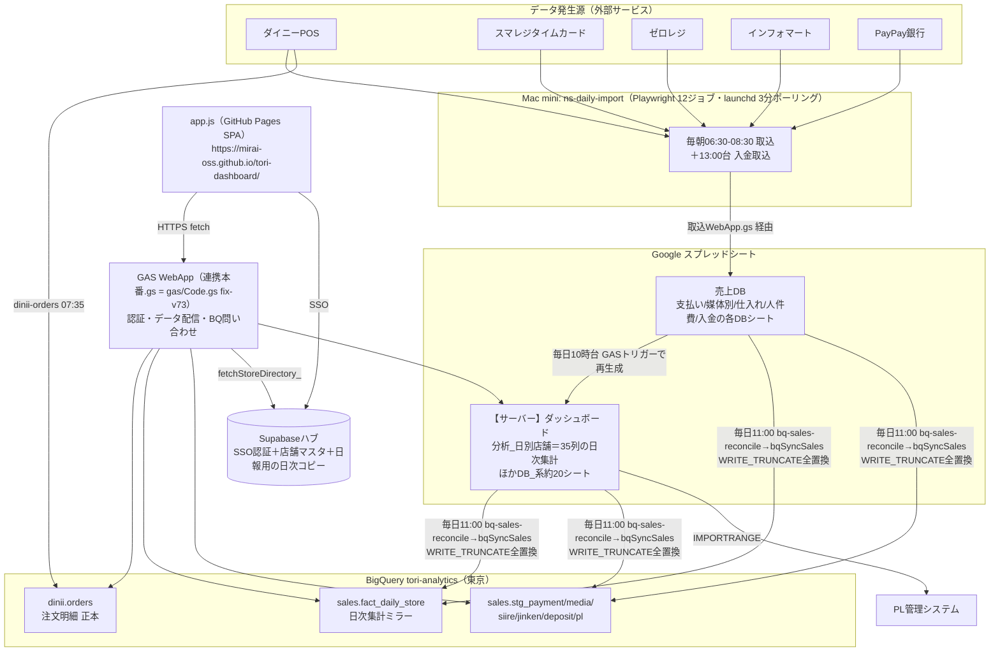

# 売上ダッシュボード（tori-dashboard）データ設計仕様書

作成: 2026-08-23 ／ 対象コード: `github.com/mirai-oss/tori-dashboard` HEAD `2bb7a90`
**本番GASのバージョン: `fix-v73`（ping実測でリポジトリHEADと完全一致を確認済み）**
用途: 外部AI（Codex等）によるコード・設計レビューの入力資料。秘密情報は含まない（キー・トークンはすべて環境変数/Script Properties/GitHub Secrets管理。スプレッドシートIDは公開リポジトリに既出のもののみ記載）。

---

## 1. 全体アーキテクチャ



### コンポーネント一覧

| コンポーネント | 実体 | 役割 |
|---|---|---|
| フロントエンド | `app.js`（素のJS SPA・GitHub Pages） | 全タブの描画・GAS呼び出し。ビルドなし |
| APIサーバー | `gas/Code.gs`（Apps Script WebApp。本番は【サーバー】ダッシュボード=シートID `1OuaAQ…fIbQ` にバインド、`executeAs: USER_DEPLOYING`） | 認証（独自ID/PW＋Supabase SSO）・シート読み・BigQuery問い合わせ・書き込み系API |
| 取込ジョブ | 別リポ `ns-daily-import`（非公開・Mac mini上） | Playwrightで外部サービスからCSV取得→売上DBのGAS（取込WebApp.gs）へPOST |
| 日次集計 | 【サーバー】ダッシュボードのGASトリガー（毎日10時台） | 売上DBの各DBシート→`分析_日別店舗`（35列）を再生成 |
| BQミラー | `bqSyncSales`（Code.gs内・毎日11:00にns-daily-importの`bq-sales-reconcile`タスクが起動） | シート→`tori-analytics.sales`をWRITE_TRUNCATE全置換＋直近35日の突合検証 |
| 認証DB | シート`アカウント`＋Supabaseハブ（SSO） | セッションはScript Propertiesに12時間保存 |
| 配信 | `.github/workflows/lark-report.yml`＋`scripts/lark-report.mjs` | 毎日12:00 Lark日報（capture-bq=ブラウザレス・reportDataBQ経由） |

---

## 2. 数字ごとの出所と流れ（データリネージ）

| 画面の数字 | 発生源 | 取込 | 中間保存 | 表示時の読み出し（シートモード / BQモード） |
|---|---|---|---|---|
| 売上・客数・組数（日次） | ダイニー・ゼロレジ | 毎朝06:30-08:00 | 売上DB→(10時台)→`分析_日別店舗` →(11:00)→`fact_daily_store` | `action:data`のdaily / `action:bqDailyStore` |
| 仕入（原価） | インフォマート | 06:45 | 同上（分析_日別店舗の仕入列） | 同上（dailyに含まれる） |
| 人件費（PA/社員） | スマレジ勤務明細CSV | 07:00 | 売上DB人件費DB→分析_日別店舗→fact_daily_store | 同上 |
| 媒体別売上 | ダイニー媒体別 | 07:30 | 媒体別DBシート(21,000行超)→`stg_media` | `action:data`のmedia（重い・実測12s） / `action:bqGetMedia`（直近3ヶ月に限定） |
| 入金 | PayPay銀行CSV | 13:00/13:15 | 入金DBシート→`stg_deposit` | `action:data`のdeposit（実測5.4s） / `action:bqGetDeposit` |
| PL（販管費） | 手入力（PL管理システム）＋経費・精算連携 | 随時＋毎日8:00自動同期 | `DB_PL`シート→`stg_pl`（更新時に`bqSyncPL`が自動追随） | `action:data`のPL / `action:bqGetPL` |
| 運営委託費 | 精算ダッシュボード | **毎週自動**（新設ワークフロー） | `syncSeisanFeeToPl`→DB_PL→stg_pl | PLに含まれる |
| 商品別・時間帯別明細 | ダイニー注文明細 | 07:35 | **BigQuery `dinii.orders`（正本・シートを経由しない）** | `action:bqDetail`（10-15分キャッシュ）。客数・組数はfix-v69以降`fact_daily_store`の実績に差し替え（同期完了ガード付き） |
| 口コミ | Google（口コミ取得ジョブ） | 日次 | `口コミ推移ログ`シート | `action:data`のreview |
| ダイニーアンケート | ダイニー | 07:45 | `ダイニーDB`シート | `action:data`のdinii（実測6.3s・裏読み） |
| 売上目標 | 手入力（目標管理タブ） | 随時 | `DB_目標`/`DB_目標月次`シート | `action:data`のtargets |
| 予約 | 管理シート | 日次 | `💾予約DB` | `action:data`の予約（実測3.3s・裏読み） |
| 店舗マスタ | **Supabaseハブ`stores`**（Day6で一本化） | リアルタイム | GAS `fetchStoreDirectory_()`が10分キャッシュで取得 | `action:data`のstoresキー（失敗時はコード内定数へフォールバック） |
| 天気 | Open-Meteo API | 表示時 | なし | フロントから直接fetch |

### データベースの役割分担（正本）

| ストア | 正本として持つもの | 備考 |
|---|---|---|
| BigQuery `dinii.orders` | 注文明細（唯一の正本） | 日付パーティション＋store_idクラスタ |
| BigQuery `sales.*` | **ミラー（正本ではない）**。正本はシート | WRITE_TRUNCATEで毎日11:00に全置換＝シートと自動一致 |
| `分析_日別店舗`シート | 日次集計の**暫定正本** | 脱スプシ計画（要件定義書§16）でBQ Factへ移行予定 |
| 売上DBの各DBシート | 取込Rawの正本 | |
| Supabaseハブ | 認証・店舗マスタの正本＋日報アプリ用の日次コピー(`dash_sales_daily`) | dash-syncが`bqDailyStoreForSync`（ログイン不要・トークン認証）経由で取得 |

---

## 3. 画面の読み込みシーケンス（現行実装）

### 起動〜表示（`app.js` `fetchDataFast()` 前後）

1. **認証**: ポータルのlocalStorageセッションがあれば無言でSSO（`supalogin`）、なければID/PW（`login`）
2. **フェーズ1（表示前・同期）**: `action:data` を**重いシートを除外して**呼ぶ
   - 除外 = `HEAVY_KEYS = ['media','deposit','dinii','予約']`（コード内の実測コメント: media=12s / dinii=6.3s / deposit=5.4s / 予約=3.3s）
   - BQモード時はさらに `daily`・`PL` も除外（BQ経路と二重取得しないため）
   - 取得期間は `months` パラメータ（既定13ヶ月・前年比の最小。localStorageで変更可・0=全期間）
3. **描画** → 以後は裏で並行取得
4. **BQモード時の並行fetch**: `bqDailyStore`（daily相当）／`bqGetPL`／`bqGetDeposit`／`bqGetMedia`（直近3ヶ月）を並列実行。返却形は既存の`sheets`形式に揃えてあり、`ingestSheets()`をそのまま再利用
5. **フェーズ2（裏読み）**: シートモード=`[dinii,media]→[deposit,予約]`、BQモード=`[dinii]→[予約]` の順で先読み（多重実行ガード付き）
6. **差分更新**: `action:version`（軽量署名）を取得し、次回自動更新時に変化がなければ再取得をスキップ

### サーバー側（`gas/Code.gs` `handle()`）

- トークン認証のみの軽量系（`ping`/`bqLoadOrders`/`bqSyncSales`/`bqDailyStoreForSync`/`reportDataBQ`等）は**`setupIfNeeded()`（全シート存在チェック）の手前で分岐**＝シートに触らない
- ログイン系アクションは `setupIfNeeded()` → セッション検証（Script Properties）→ 各処理
- `bqDetail` はサーバー側10〜15分キャッシュ（CacheService・キーはMD5短縮）。担当店舗が限定されたアカウントはSQLレベルで店舗IDを強制絞り込み

### 二重系の現状（重要）

| タブ | シートモード（**既定**） | BQモード（`S.useBqDaily`・**管理者のみの🧪トグル・テスト中**） |
|---|---|---|
| 推移分析・ダッシュボード・目標 | `sheets.daily` | `bqDailyStore`（fact_daily_store） |
| PL | `sheets.PL` | `bqGetPL`（stg_pl） |
| 入金 | `sheets.deposit` | `bqGetDeposit`（stg_deposit） |
| 媒体別 | `sheets.media`（21,000行・12秒） | `bqGetMedia`（直近3ヶ月限定） |
| 明細分析 | 常にBQ（dinii.orders） | 同左＋客数実績をfact_daily_storeで補正 |
| 口コミ・ダイニー・予約・広告 | 常にシート | 同左（BQ化未着手） |

**既定はまだシートモード**。BQモードはlocalStorageフラグで、管理者が推移分析タブのトグルから切り替えてテスト中の位置づけ。

---

## 4. 「数字が反映されるまで遅い」の分析（2軸に分解）

### 軸A: 画面の表示速度（開いてから数字が出るまで）

| ボトルネック | 現状 | 状態 |
|---|---|---|
| GAS往復そのもの（コールドスタート＋シート読み） | 当初28秒→フェーズ分割（HEAVY_KEYS除外）で軽量部分を先に表示する構造に改善済み | 対応済みだが**シートモードである限りGAS+シート読みは残る** |
| 媒体別シート21,000行（12秒） | フェーズ2裏読み化＋BQモードでは3ヶ月限定のBQ読みに | 対応済み（BQモード時） |
| ログイン直後の同期エラー（媒体別のBQ対応漏れ） | fix（3ba41d3）済み | 対応済み |
| BQモード各アクションの実測 | 診断アクション追加済み（fix-v71: 所要時間計測、fix-v70/72/73: 明細vs日次の数値突合） | **計測・検証の途中**（「全体が遅い」報告を受けた調査が進行中） |
| dinii(6.3s)・予約(3.3s)・口コミ等 | シート読みのまま | 未対応（BQ/Supabase化の候補） |

### 軸B: データの鮮度（昨日の数字がいつ見えるか）★ユーザー体感の主因はおそらくこちら

現在の鮮度チェーン（昨日の売上が見えるまで）:

```
06:30-08:30 取込ジョブ → 売上DB
10時台      分析_日別店舗の再生成（GASトリガー）  ← シートモードはここから見える
11:00       BQミラー（bq-sales-reconcile）        ← BQモードはここから見える
12:00       Lark日報配信
```

- **シートモードでも昨日の数字が揃うのは10時台**（それまでの朝の時間帯は前々日まで）
- **BQモードは11:00まで昨日分が出ない**（8/23の障害調査で実証されたとおり）
- 入金は13時台取込のため当日夕方から

### 改善提案（優先順・レビュー対象）

1. **【鮮度・最小工数】ミラーと再生成の実行時刻を前倒し＋多頻度化**: 朝バッチ完了直後（08:45）に「分析再生成→bqSyncSales」を連続実行する1タスクを追加（現行の10時台/11:00は保険として残す）。これだけで朝イチから昨日分が見える。bqSyncSalesは全置換・冪等なので多頻度実行しても安全
2. **【表示速度・本命】BQモードの既定化**: 診断アクション（fix-v70〜73）の数値検証が完了したら、`useBqDaily`の既定をtrueに反転し、シート読みはフォールバックに降格。あわせてdinii・予約・口コミのBQ/Supabase化を検討
3. **【構造】将来形はGAS排除**: app→GAS→BQという2段構成のGAS部分がコールドスタート・6分実行制限・quotaの根源。要件定義書§26の最終形（集計結果をSupabaseに置きRLS付きで直読み）に沿って、認証済みユーザーがSupabase RESTから直接読む構成が最速（実測0.1〜0.3秒/リクエスト）
4. **【安全網】朝の見張り番**: 昨日分の有無をGitHub Actionsから毎朝チェックし、無い時だけLark警告（8/23の「無通知障害」の再発防止。別途提案済み）

---

## 5. レビュー時の注意点・既知の罠

1. **デプロイの2段階**: リポジトリのCode.gsを更新しても本番には反映されない。`projects.versions.create`→`deployments.update`（または手動デプロイ）が必要。**本番バージョンは必ず`?action=ping`の`ver`で確認**（現在fix-v73）
2. **GAS WebAppへのcurlはGET必須**（POSTは302リダイレクト先で405になる）
3. **appsscript.jsonを全文置換するとBigQuery設定が消えて全滅**（過去に実事故）。`enabledAdvancedServices`のBigQuery(v2)を保持すること
4. **売上DBの各DBシートは1行目=説明・2行目=ヘッダー・3行目〜データ**の2行プリアンブル構造（分析_日別店舗だけ1行ヘッダー）
5. **BQミラーはWRITE_TRUNCATE**: シートが正本・BQは毎日全置換。BQ側だけを直すのは無意味（翌日消える）
6. **比率列のNaN/Infinity**はNULL化してからBQロード（`maxBadRecords:0`のため1件でも壊れると全体失敗）
7. **店舗名の表記ゆれ**はSupabase`store_aliases`が正（Day6でシートの対応表から移行。GAS`resolveAdStore_`は取得失敗時のみ旧シート方式にフォールバック）
8. **日付比較は文字列（yyyy-MM-dd）で統一**（DateオブジェクトとBQのDATE比較は境界1日がズレる）
9. **セッションはScript Propertiesに12時間**・失敗10回で10分ロック。`bqDetail`のSQLは文字列連結（値はシート由来で限定的だがパラメータ化されていない）
10. **診断用の一時アクション**（`perfDiag`系・`storeMapDiag`・`plSeisanDiag`・`detailVsDailyDiag`）と診断用ワークフロー（`bq-diag.yml`等）が複数残っている。調査完了後の掃除対象

## 6. 関連リポジトリ・資料

| 資料 | 場所 |
|---|---|
| フロント＋GASソース | `github.com/mirai-oss/tori-dashboard`（公開） |
| 取込ジョブ12本 | `github.com/mirai-oss/ns-daily-import`（非公開・Mac mini実行） |
| GAS本番バックアップ＋BQミラー実装の詳細記録 | `NStyle-AI/gas-backup/dashboard-server/README.md`（非公開） |
| 全体要件・データ基盤ロードマップ | `ns-portal/docs/要件定義書.md` v3.4 §16・§26／`docs/データ基盤統合ロードマップ.md` |
| 作業ログ（時系列の正） | `ns-portal/WORKLOG.md` |
