# 実装スケジュール: 最短計画（2026-08-23確定）

ユーザー確定: 請求書管理が最優先／並行2本目はPL3点セット先／シフト管理UI v5（4ステップ）を店長・本部側の確定デザインとして採用（従業員側は採用済みのGeminiモック）。

## 並行ライン構成（2ライン＋小粒タスク）

```mermaid
gantt
    dateFormat  X
    axisFormat W%d
    section ライン1(最優先)
    請求書Phase1 MVP(5日)        :0, 5
    請求書フィードバック反映+1.5   :5, 8
    section ライン2
    PL3点セット(補助科目→スポット→MF) :0, 5
    シフトUI v5 ①②(調整グリッド)     :5, 10
    シフトUI v5 ③④(確定/実績・叶え率) :10, 14
    section 小粒(隙間で)
    BQモード既定化 :0, 1
    朝の見張り番    :1, 2
```

## ライン1: 請求書メール管理（最優先・5日でMVP）

指示書: `docs/実装指示書_請求書メール管理Phase1_2026-08-23.md`
D1 DB/RLS/RPC → D2 GAS取込+Edge Function+3ヶ月バックフィル → D3-4 UI → D5 E2E・公開。
ユーザー作業: GASの5分トリガー設置（1分・手順書付きで依頼が来る）のみ。

## ライン2: PL3点セット → シフトUI v5

1. **PL3点セット（4〜5日）**: `docs/設計書_PL補助科目・スポット人件費・MF取込_2026-08-23.md`（実CSVサンプル検証済み・実装可能状態）。補助科目1日→スポット人件費1日→MF取込2〜3日
2. **シフトUI v5 ①②（週2）**: 店長・本部側画面。①希望シフト確認（半月カレンダー・日別希望者・ガント）②調整グリッド（不足セル・ヘルプ候補・人件費4カード・公開前チェック）。§27のM1（B2作成グリッド・B16管理画面）＋U3過不足・U4人件費率・U8公開前チェックに相当。モック: `docs/mockups/NStyle_シフト管理_UI_v5.html`
3. **シフトUI v5 ③④（週3）**: ③確定シフト（公開後確認・未確認者再通知・変更申請）④実績・差分（**叶え率**=希望vs実績・日別差分・PA削減/超過。データはPhase 2で取込済みのBQ勤怠実績を使用）。④の実績時間修正→スマレジ書き戻しは`timecard.attendances:write`スコープ申請（ユーザー操作・過去のshifts:writeと同手順）が前提
4. その後: 請求書Phase 2／シフトM3（U6店舗間ヘルプ・U9本部横断）／AI提案（U7）

## 小粒タスク（隙間に差し込む・各0.5日）

- **BQモード既定化**（ダッシュボード高速化の残り。morning-refresh翌朝確認→ユーザー承認→段階展開）
- **朝の見張り番**（昨日分データ有無をGitHub Actionsが毎朝チェック→無い時だけLark警告。8/23障害の再発防止）
- Day 7残り: シート停止テスト（ユーザーと日程調整のうえ実施）／nippo12店舗の目視確認／Chatworkグループ（保留中）

## 優先順位の考え方（記録）

1. **請求書 = 今すぐ**（二重振込リスクという実害の防止。他と依存なしで独立して走れる）
2. **PL3点セット = 設計が新鮮なうちに**（実CSV検証まで完了済み。会計業務の月次サイクルに早く乗せる）
3. **シフトUI v5 = PL後**（④実績画面は勤怠データ基盤=完成済みを使うため技術的依存はゼロ。デザイン確定済みなので着手すれば速い）
4. スマレジ書き戻し・AI系（OCR/シフト提案）は器だけ用意して後続フェーズへ
